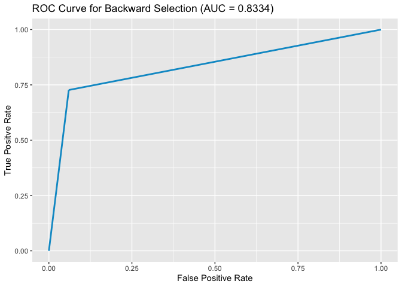

Student Dropout Prediction: Logistic Regression
================
Noah Khan
June 5, 2024

- [Load Libraries, Functions, and
  Dataset](#load-libraries-functions-and-dataset)
- [Creating Indicator Variables](#creating-indicator-variables)
- [Training and Testing Data Split](#training-and-testing-data-split)
- [Full Logistic Model](#full-logistic-model)
  - [Model Evaluation](#model-evaluation)
- [Reduced Model](#reduced-model)
  - [Model Evaluation](#model-evaluation-1)
- [Forward Selection](#forward-selection)
  - [Model Evaluation](#model-evaluation-2)
- [Backward Selection](#backward-selection)
  - [Model Evaluation](#model-evaluation-3)
- [Ridge Regression](#ridge-regression)
  - [Model Evaluation](#model-evaluation-4)
- [Lasso Regression](#lasso-regression)
  - [Model Evaluation](#model-evaluation-5)
- [Model Selection](#model-selection)

## Load Libraries, Functions, and Dataset

``` r
library(caTools)
library(fastDummies)
```

    ## Thank you for using fastDummies!

    ## To acknowledge our work, please cite the package:

    ## Kaplan, J. & Schlegel, B. (2023). fastDummies: Fast Creation of Dummy (Binary) Columns and Rows from Categorical Variables. Version 1.7.1. URL: https://github.com/jacobkap/fastDummies, https://jacobkap.github.io/fastDummies/.

``` r
library(glmnet)
```

    ## Loading required package: Matrix

    ## Loaded glmnet 4.1-8

``` r
library(ggplot2)
library(plotROC)

# a seed will be used to reproduce all results
set.seed(12345)

# load the altered dataset
studentsData <- read.csv("data_altered.csv")

# load function to compute metric
source("testingMetrics.R")

# load function to plot roc curve
source("ROCplot.R")
```

## Creating Indicator Variables

Some of the predictors do not consist of binary values. Therefore,
indicator variables are needed before fitting a logistic regression
model.

``` r
# create the indicator variable for predictors that are not binary
studentsData <- dummy_cols(studentsData, select_columns = c('Marital_Status',
                      'Application_Type', 'Application_Order', 'Academic_Path',
                      'Previous_Qualification', 'Nationality', 'Gender'), 
                     remove_selected_columns = TRUE, remove_first_dummy = TRUE)
```

## Training and Testing Data Split

The dataset will be split into a training and testing dataset to
evaluate each of the regression models. A 75:25 ratio will be used for
the split.

``` r
# split the dataset
dataSplit <- sample.split(studentsData$Dropped_Out, SplitRatio = 0.75)

# define the training and testing dataset
trainingData <- subset(studentsData, dataSplit == TRUE)
testingData <- subset(studentsData, dataSplit == FALSE)

# a vector that contains the names of the models
modelNames <- c("Full Model", "Reduced Model", "Forward Selection", 
                "Backward Selection", "Ridge", "Lasso")
```

## Full Logistic Model

``` r
# consider a full logistic regression model
fullModel <- glm(Dropped_Out ~., family = "binomial", data = trainingData)
print(summary(fullModel))
```

    ## 
    ## Call:
    ## glm(formula = Dropped_Out ~ ., family = "binomial", data = trainingData)
    ## 
    ## Coefficients:
    ##                                                                  Estimate
    ## (Intercept)                                                     -8.904735
    ## Daytime_Attendance                                              -0.587223
    ## Previous_Qualification_.Grade.                                   0.007734
    ## Admission_Grade                                                 -0.010293
    ## Displaced                                                        0.495413
    ## Special_Needs                                                    0.216335
    ## Debtor                                                           0.417439
    ## Tuition_Current                                                 -2.438219
    ## Scholarship_Holder                                              -0.478570
    ## Age_At_Enrollment                                                0.041321
    ## X1st_Sem_Units_Credited                                          0.122765
    ## X1st_Sem_Units_Enrolled                                         -0.019292
    ## X1st_Sem_Units_Evaluations                                      -0.001931
    ## X1st_Sem_Units_Approved                                         -0.342888
    ## X1st_Sem_Units_Grade                                             0.075056
    ## X1st_Sem_Units_Without_Evaluations                              -0.054589
    ## X2nd_Sem_Units_Credited                                          0.226021
    ## X2nd_Sem_Units_Enrolled                                          0.548853
    ## X2nd_Sem_Units_Evaluations                                      -0.016988
    ## X2nd_Sem_Units_Approved                                         -0.630111
    ## X2nd_Sem_Units_Grade                                            -0.064448
    ## X2nd_Sem_Units_Without_Evaluations                              -0.035121
    ## Unemployment_Rate                                                0.105543
    ## Inflation_Rate                                                   0.051123
    ## GDP                                                              0.050561
    ## `Marital_Status_facto union`                                    -0.756679
    ## `Marital_Status_legally separated`                               1.176446
    ## Marital_Status_married                                           0.687155
    ## Marital_Status_single                                            0.758038
    ## Marital_Status_widower                                          -1.624084
    ## `Application_Type_2nd phase - general contingent`                0.095944
    ## `Application_Type_3rd phase - general contingent`                0.356912
    ## `Application_Type_Change of course and/or institution`          -0.218674
    ## `Application_Type_Diploma Holder`                               -1.387043
    ## `Application_Type_Holders of other higher courses`               0.125053
    ## `Application_Type_International student (bachelor)`             -1.188538
    ## Application_Type_Other                                           1.604509
    ## `Application_Type_Over 23 years old`                             0.291538
    ## Application_Type_Transfer                                        0.294257
    ## `Application_Order_Last Choice`                                 -1.929927
    ## Application_Order_Other                                          9.778365
    ## `Application_Order_Second Choice`                                9.638299
    ## `Application_Order_Third Choice`                                 9.531110
    ## Academic_Path_Agronomy                                          -0.855273
    ## `Academic_Path_Animation and Multimedia Design`                 -0.554857
    ## `Academic_Path_Basic Education`                                  0.649928
    ## `Academic_Path_Biofuel Production Technologies`                  0.532572
    ## `Academic_Path_Communication Design`                            -0.755101
    ## Academic_Path_Equinculture                                       0.726109
    ## `Academic_Path_Informatics Engineering`                         -1.023100
    ## `Academic_Path_Journalism and Communication`                     0.117520
    ## Academic_Path_Management                                        -0.744253
    ## Academic_Path_Nursing                                           -0.472406
    ## `Academic_Path_Oral Hygiene`                                    -0.314726
    ## `Academic_Path_Social Service`                                  -1.060910
    ## Academic_Path_Tourism                                           -0.086871
    ## `Academic_Path_Veterinary Nursing`                              -0.811253
    ## `Previous_Qualification_Below Secondary`                        -1.765278
    ## Previous_Qualification_Doctorate                                 4.952330
    ## `Previous_Qualification_Frequency of higher education`          -0.085932
    ## `Previous_Qualification_Higher education - degree`              -0.480109
    ## `Previous_Qualification_Higher education - degree (1st cycle)`  -0.865041
    ## `Previous_Qualification_Higher education - master (2nd cycle)`  -1.940806
    ## `Previous_Qualification_Master's`                                0.203686
    ## `Previous_Qualification_Professional higher technical course`   -0.979986
    ## `Previous_Qualification_Secondary education`                    -1.441653
    ## `Previous_Qualification_Technological specialization course`    -0.713755
    ## Nationality_Portuguese                                           0.627466
    ## Gender_Male                                                      0.295167
    ##                                                                Std. Error
    ## (Intercept)                                                    535.413518
    ## Daytime_Attendance                                               0.258043
    ## Previous_Qualification_.Grade.                                   0.005414
    ## Admission_Grade                                                  0.005203
    ## Displaced                                                        0.143033
    ## Special_Needs                                                    0.465350
    ## Debtor                                                           0.197844
    ## Tuition_Current                                                  0.215617
    ## Scholarship_Holder                                               0.163574
    ## Age_At_Enrollment                                                0.013300
    ## X1st_Sem_Units_Credited                                          0.097668
    ## X1st_Sem_Units_Enrolled                                          0.118852
    ## X1st_Sem_Units_Evaluations                                       0.029306
    ## X1st_Sem_Units_Approved                                          0.064192
    ## X1st_Sem_Units_Grade                                             0.029074
    ## X1st_Sem_Units_Without_Evaluations                               0.128958
    ## X2nd_Sem_Units_Credited                                          0.102144
    ## X2nd_Sem_Units_Enrolled                                          0.119374
    ## X2nd_Sem_Units_Evaluations                                       0.027955
    ## X2nd_Sem_Units_Approved                                          0.059477
    ## X2nd_Sem_Units_Grade                                             0.027562
    ## X2nd_Sem_Units_Without_Evaluations                               0.101521
    ## Unemployment_Rate                                                0.025215
    ## Inflation_Rate                                                   0.043289
    ## GDP                                                              0.029832
    ## `Marital_Status_facto union`                                     1.012883
    ## `Marital_Status_legally separated`                               1.497537
    ## Marital_Status_married                                           0.475982
    ## Marital_Status_single                                            0.471012
    ## Marital_Status_widower                                           1.735302
    ## `Application_Type_2nd phase - general contingent`                0.166125
    ## `Application_Type_3rd phase - general contingent`                0.370007
    ## `Application_Type_Change of course and/or institution`           0.247177
    ## `Application_Type_Diploma Holder`                                0.625037
    ## `Application_Type_Holders of other higher courses`               0.594899
    ## `Application_Type_International student (bachelor)`              0.839381
    ## Application_Type_Other                                           0.962841
    ## `Application_Type_Over 23 years old`                             0.258920
    ## Application_Type_Transfer                                        0.412703
    ## `Application_Order_Last Choice`                                757.186190
    ## Application_Order_Other                                        535.411719
    ## `Application_Order_Second Choice`                              535.411693
    ## `Application_Order_Third Choice`                               535.411725
    ## Academic_Path_Agronomy                                           0.419317
    ## `Academic_Path_Animation and Multimedia Design`                  0.536013
    ## `Academic_Path_Basic Education`                                  0.332651
    ## `Academic_Path_Biofuel Production Technologies`                  1.423534
    ## `Academic_Path_Communication Design`                             0.366184
    ## Academic_Path_Equinculture                                       0.377493
    ## `Academic_Path_Informatics Engineering`                          0.363566
    ## `Academic_Path_Journalism and Communication`                     0.307629
    ## Academic_Path_Management                                         0.287772
    ## Academic_Path_Nursing                                            0.326009
    ## `Academic_Path_Oral Hygiene`                                     0.596799
    ## `Academic_Path_Social Service`                                   0.319938
    ## Academic_Path_Tourism                                            0.323337
    ## `Academic_Path_Veterinary Nursing`                               0.341296
    ## `Previous_Qualification_Below Secondary`                         0.815963
    ## Previous_Qualification_Doctorate                               535.412089
    ## `Previous_Qualification_Frequency of higher education`           1.136939
    ## `Previous_Qualification_Higher education - degree`               0.858222
    ## `Previous_Qualification_Higher education - degree (1st cycle)`   0.970217
    ## `Previous_Qualification_Higher education - master (2nd cycle)`   1.889725
    ## `Previous_Qualification_Master's`                                1.152268
    ## `Previous_Qualification_Professional higher technical course`    1.172313
    ## `Previous_Qualification_Secondary education`                     0.763955
    ## `Previous_Qualification_Technological specialization course`     0.956240
    ## Nationality_Portuguese                                           0.457633
    ## Gender_Male                                                      0.134160
    ##                                                                z value Pr(>|z|)
    ## (Intercept)                                                     -0.017 0.986731
    ## Daytime_Attendance                                              -2.276 0.022865
    ## Previous_Qualification_.Grade.                                   1.429 0.153101
    ## Admission_Grade                                                 -1.978 0.047878
    ## Displaced                                                        3.464 0.000533
    ## Special_Needs                                                    0.465 0.642013
    ## Debtor                                                           2.110 0.034864
    ## Tuition_Current                                                -11.308  < 2e-16
    ## Scholarship_Holder                                              -2.926 0.003437
    ## Age_At_Enrollment                                                3.107 0.001891
    ## X1st_Sem_Units_Credited                                          1.257 0.208767
    ## X1st_Sem_Units_Enrolled                                         -0.162 0.871055
    ## X1st_Sem_Units_Evaluations                                      -0.066 0.947475
    ## X1st_Sem_Units_Approved                                         -5.342 9.21e-08
    ## X1st_Sem_Units_Grade                                             2.582 0.009836
    ## X1st_Sem_Units_Without_Evaluations                              -0.423 0.672071
    ## X2nd_Sem_Units_Credited                                          2.213 0.026914
    ## X2nd_Sem_Units_Enrolled                                          4.598 4.27e-06
    ## X2nd_Sem_Units_Evaluations                                      -0.608 0.543381
    ## X2nd_Sem_Units_Approved                                        -10.594  < 2e-16
    ## X2nd_Sem_Units_Grade                                            -2.338 0.019372
    ## X2nd_Sem_Units_Without_Evaluations                              -0.346 0.729381
    ## Unemployment_Rate                                                4.186 2.84e-05
    ## Inflation_Rate                                                   1.181 0.237615
    ## GDP                                                              1.695 0.090099
    ## `Marital_Status_facto union`                                    -0.747 0.455030
    ## `Marital_Status_legally separated`                               0.786 0.432109
    ## Marital_Status_married                                           1.444 0.148835
    ## Marital_Status_single                                            1.609 0.107533
    ## Marital_Status_widower                                          -0.936 0.349320
    ## `Application_Type_2nd phase - general contingent`                0.578 0.563574
    ## `Application_Type_3rd phase - general contingent`                0.965 0.334742
    ## `Application_Type_Change of course and/or institution`          -0.885 0.376325
    ## `Application_Type_Diploma Holder`                               -2.219 0.026477
    ## `Application_Type_Holders of other higher courses`               0.210 0.833505
    ## `Application_Type_International student (bachelor)`             -1.416 0.156784
    ## Application_Type_Other                                           1.666 0.095627
    ## `Application_Type_Over 23 years old`                             1.126 0.260175
    ## Application_Type_Transfer                                        0.713 0.475846
    ## `Application_Order_Last Choice`                                 -0.003 0.997966
    ## Application_Order_Other                                          0.018 0.985429
    ## `Application_Order_Second Choice`                                0.018 0.985638
    ## `Application_Order_Third Choice`                                 0.018 0.985797
    ## Academic_Path_Agronomy                                          -2.040 0.041382
    ## `Academic_Path_Animation and Multimedia Design`                 -1.035 0.300597
    ## `Academic_Path_Basic Education`                                  1.954 0.050727
    ## `Academic_Path_Biofuel Production Technologies`                  0.374 0.708315
    ## `Academic_Path_Communication Design`                            -2.062 0.039200
    ## Academic_Path_Equinculture                                       1.924 0.054417
    ## `Academic_Path_Informatics Engineering`                         -2.814 0.004892
    ## `Academic_Path_Journalism and Communication`                     0.382 0.702448
    ## Academic_Path_Management                                        -2.586 0.009702
    ## Academic_Path_Nursing                                           -1.449 0.147322
    ## `Academic_Path_Oral Hygiene`                                    -0.527 0.597945
    ## `Academic_Path_Social Service`                                  -3.316 0.000913
    ## Academic_Path_Tourism                                           -0.269 0.788183
    ## `Academic_Path_Veterinary Nursing`                              -2.377 0.017455
    ## `Previous_Qualification_Below Secondary`                        -2.163 0.030508
    ## Previous_Qualification_Doctorate                                 0.009 0.992620
    ## `Previous_Qualification_Frequency of higher education`          -0.076 0.939752
    ## `Previous_Qualification_Higher education - degree`              -0.559 0.575873
    ## `Previous_Qualification_Higher education - degree (1st cycle)`  -0.892 0.372610
    ## `Previous_Qualification_Higher education - master (2nd cycle)`  -1.027 0.304406
    ## `Previous_Qualification_Master's`                                0.177 0.859689
    ## `Previous_Qualification_Professional higher technical course`   -0.836 0.403188
    ## `Previous_Qualification_Secondary education`                    -1.887 0.059148
    ## `Previous_Qualification_Technological specialization course`    -0.746 0.455415
    ## Nationality_Portuguese                                           1.371 0.170340
    ## Gender_Male                                                      2.200 0.027799
    ##                                                                   
    ## (Intercept)                                                       
    ## Daytime_Attendance                                             *  
    ## Previous_Qualification_.Grade.                                    
    ## Admission_Grade                                                *  
    ## Displaced                                                      ***
    ## Special_Needs                                                     
    ## Debtor                                                         *  
    ## Tuition_Current                                                ***
    ## Scholarship_Holder                                             ** 
    ## Age_At_Enrollment                                              ** 
    ## X1st_Sem_Units_Credited                                           
    ## X1st_Sem_Units_Enrolled                                           
    ## X1st_Sem_Units_Evaluations                                        
    ## X1st_Sem_Units_Approved                                        ***
    ## X1st_Sem_Units_Grade                                           ** 
    ## X1st_Sem_Units_Without_Evaluations                                
    ## X2nd_Sem_Units_Credited                                        *  
    ## X2nd_Sem_Units_Enrolled                                        ***
    ## X2nd_Sem_Units_Evaluations                                        
    ## X2nd_Sem_Units_Approved                                        ***
    ## X2nd_Sem_Units_Grade                                           *  
    ## X2nd_Sem_Units_Without_Evaluations                                
    ## Unemployment_Rate                                              ***
    ## Inflation_Rate                                                    
    ## GDP                                                            .  
    ## `Marital_Status_facto union`                                      
    ## `Marital_Status_legally separated`                                
    ## Marital_Status_married                                            
    ## Marital_Status_single                                             
    ## Marital_Status_widower                                            
    ## `Application_Type_2nd phase - general contingent`                 
    ## `Application_Type_3rd phase - general contingent`                 
    ## `Application_Type_Change of course and/or institution`            
    ## `Application_Type_Diploma Holder`                              *  
    ## `Application_Type_Holders of other higher courses`                
    ## `Application_Type_International student (bachelor)`               
    ## Application_Type_Other                                         .  
    ## `Application_Type_Over 23 years old`                              
    ## Application_Type_Transfer                                         
    ## `Application_Order_Last Choice`                                   
    ## Application_Order_Other                                           
    ## `Application_Order_Second Choice`                                 
    ## `Application_Order_Third Choice`                                  
    ## Academic_Path_Agronomy                                         *  
    ## `Academic_Path_Animation and Multimedia Design`                   
    ## `Academic_Path_Basic Education`                                .  
    ## `Academic_Path_Biofuel Production Technologies`                   
    ## `Academic_Path_Communication Design`                           *  
    ## Academic_Path_Equinculture                                     .  
    ## `Academic_Path_Informatics Engineering`                        ** 
    ## `Academic_Path_Journalism and Communication`                      
    ## Academic_Path_Management                                       ** 
    ## Academic_Path_Nursing                                             
    ## `Academic_Path_Oral Hygiene`                                      
    ## `Academic_Path_Social Service`                                 ***
    ## Academic_Path_Tourism                                             
    ## `Academic_Path_Veterinary Nursing`                             *  
    ## `Previous_Qualification_Below Secondary`                       *  
    ## Previous_Qualification_Doctorate                                  
    ## `Previous_Qualification_Frequency of higher education`            
    ## `Previous_Qualification_Higher education - degree`                
    ## `Previous_Qualification_Higher education - degree (1st cycle)`    
    ## `Previous_Qualification_Higher education - master (2nd cycle)`    
    ## `Previous_Qualification_Master's`                                 
    ## `Previous_Qualification_Professional higher technical course`     
    ## `Previous_Qualification_Secondary education`                   .  
    ## `Previous_Qualification_Technological specialization course`      
    ## Nationality_Portuguese                                            
    ## Gender_Male                                                    *  
    ## ---
    ## Signif. codes:  0 '***' 0.001 '**' 0.01 '*' 0.05 '.' 0.1 ' ' 1
    ## 
    ## (Dispersion parameter for binomial family taken to be 1)
    ## 
    ##     Null deviance: 4166.3  on 3317  degrees of freedom
    ## Residual deviance: 1993.4  on 3249  degrees of freedom
    ## AIC: 2131.4
    ## 
    ## Number of Fisher Scoring iterations: 12

### Model Evaluation

It is not likely that the full logistic model will be the best model to
predict a student dropping out. But, we will evaluate this model so we
can compare the results with the other proposed models.

#### Training Data

``` r
# predicted outcome for dropout
full.prob.train <- predict(fullModel, trainingData, type = "response")
full.pred.train <- ifelse(full.prob.train >= 0.5, 1, 0)

# error rate for full model
print(fullModel.trainingError <- 1- mean(full.pred.train == trainingData[, "Dropped_Out"]))
```

    ## [1] 0.1187462

``` r
# confusion matrix
print(matrix.confusion.full.train <- table(full.pred.train, trainingData[, "Dropped_Out"]))
```

    ##                
    ## full.pred.train    0    1
    ##               0 2136  278
    ##               1  116  788

#### Testing Data

``` r
# predicted outcome for dropout
full.prob.test <- predict(fullModel, testingData, type = "response")
full.pred.test <- ifelse(full.prob.test >= 0.5, 1, 0)

# error rate for full model
print(fullModel.testingError <- 1- mean(full.pred.test == testingData[, "Dropped_Out"]))
```

    ## [1] 0.1274864

``` r
# confusion matrix
print(matrix.confusion.full.test <- table(full.pred.test, testingData[, "Dropped_Out"]))
```

    ##               
    ## full.pred.test   0   1
    ##              0 710 100
    ##              1  41 255

``` r
# compute the accuracy, precision, and recall for the testing data
fulltestingMetrics <- testingMetrics(matrix.confusion.full.test)

# print the results
## accuracy
print(fullAccuracy <- as.numeric(fulltestingMetrics[1]))
```

    ## [1] 0.8725136

``` r
## precision
print(fullPrecision <- as.numeric(fulltestingMetrics[2]))
```

    ## [1] 0.9454061

``` r
## recall
print(fullRecall <- as.numeric(fulltestingMetrics[3]))
```

    ## [1] 0.8765432

``` r
# compute the ROC and AUC
rocAUC.full <- ROCplot(testingData$Dropped_Out, full.pred.test, modelNames[1])

# plot the ROC
print(rocAUC.full[1])
```

    ## [[1]]

<!-- -->

## Reduced Model

We will consider a reduced logistic regression model. Starting from the
full logistic model already defined, we will drop the predictors that
are not significant. The process will continue until the model only
contains predictors that are significant.

``` r
reducedModel <- glm(Dropped_Out ~ Displaced + Tuition_Current + 
                      X1st_Sem_Units_Approved + X2nd_Sem_Units_Enrolled + 
                      X2nd_Sem_Units_Approved +
                        Unemployment_Rate + `Academic_Path_Social Service`, 
                      family = "binomial", data = trainingData)
print(summary(reducedModel))
```

    ## 
    ## Call:
    ## glm(formula = Dropped_Out ~ Displaced + Tuition_Current + X1st_Sem_Units_Approved + 
    ##     X2nd_Sem_Units_Enrolled + X2nd_Sem_Units_Approved + Unemployment_Rate + 
    ##     `Academic_Path_Social Service`, family = "binomial", data = trainingData)
    ## 
    ## Coefficients:
    ##                                Estimate Std. Error z value Pr(>|z|)    
    ## (Intercept)                     0.47811    0.32376   1.477  0.13975    
    ## Displaced                       0.11215    0.11294   0.993  0.32072    
    ## Tuition_Current                -2.54796    0.18282 -13.937  < 2e-16 ***
    ## X1st_Sem_Units_Approved        -0.17667    0.04361  -4.051 5.09e-05 ***
    ## X2nd_Sem_Units_Enrolled         0.64351    0.03851  16.708  < 2e-16 ***
    ## X2nd_Sem_Units_Approved        -0.70855    0.04257 -16.646  < 2e-16 ***
    ## Unemployment_Rate               0.06476    0.02041   3.173  0.00151 ** 
    ## `Academic_Path_Social Service` -0.48107    0.18935  -2.541  0.01107 *  
    ## ---
    ## Signif. codes:  0 '***' 0.001 '**' 0.01 '*' 0.05 '.' 0.1 ' ' 1
    ## 
    ## (Dispersion parameter for binomial family taken to be 1)
    ## 
    ##     Null deviance: 4166.3  on 3317  degrees of freedom
    ## Residual deviance: 2273.3  on 3310  degrees of freedom
    ## AIC: 2289.3
    ## 
    ## Number of Fisher Scoring iterations: 5

``` r
# drop the predictors that aren't significant
reducedModel <- glm(Dropped_Out ~ Tuition_Current + 
                        X1st_Sem_Units_Approved + X2nd_Sem_Units_Enrolled + 
                        X2nd_Sem_Units_Approved, 
                         family = "binomial", data = trainingData)
print(summary(reducedModel))
```

    ## 
    ## Call:
    ## glm(formula = Dropped_Out ~ Tuition_Current + X1st_Sem_Units_Approved + 
    ##     X2nd_Sem_Units_Enrolled + X2nd_Sem_Units_Approved, family = "binomial", 
    ##     data = trainingData)
    ## 
    ## Coefficients:
    ##                         Estimate Std. Error z value Pr(>|z|)    
    ## (Intercept)              1.21099    0.22120   5.475 4.39e-08 ***
    ## Tuition_Current         -2.48592    0.17985 -13.822  < 2e-16 ***
    ## X1st_Sem_Units_Approved -0.17323    0.04315  -4.015 5.95e-05 ***
    ## X2nd_Sem_Units_Enrolled  0.62954    0.03784  16.636  < 2e-16 ***
    ## X2nd_Sem_Units_Approved -0.69959    0.04205 -16.638  < 2e-16 ***
    ## ---
    ## Signif. codes:  0 '***' 0.001 '**' 0.01 '*' 0.05 '.' 0.1 ' ' 1
    ## 
    ## (Dispersion parameter for binomial family taken to be 1)
    ## 
    ##     Null deviance: 4166.3  on 3317  degrees of freedom
    ## Residual deviance: 2291.1  on 3313  degrees of freedom
    ## AIC: 2301.1
    ## 
    ## Number of Fisher Scoring iterations: 5

``` r
# compare the two models
anova(reducedModel, fullModel, test = "Chisq")
```

    ## Analysis of Deviance Table
    ## 
    ## Model 1: Dropped_Out ~ Tuition_Current + X1st_Sem_Units_Approved + X2nd_Sem_Units_Enrolled + 
    ##     X2nd_Sem_Units_Approved
    ## Model 2: Dropped_Out ~ Daytime_Attendance + Previous_Qualification_.Grade. + 
    ##     Admission_Grade + Displaced + Special_Needs + Debtor + Tuition_Current + 
    ##     Scholarship_Holder + Age_At_Enrollment + X1st_Sem_Units_Credited + 
    ##     X1st_Sem_Units_Enrolled + X1st_Sem_Units_Evaluations + X1st_Sem_Units_Approved + 
    ##     X1st_Sem_Units_Grade + X1st_Sem_Units_Without_Evaluations + 
    ##     X2nd_Sem_Units_Credited + X2nd_Sem_Units_Enrolled + X2nd_Sem_Units_Evaluations + 
    ##     X2nd_Sem_Units_Approved + X2nd_Sem_Units_Grade + X2nd_Sem_Units_Without_Evaluations + 
    ##     Unemployment_Rate + Inflation_Rate + GDP + `Marital_Status_facto union` + 
    ##     `Marital_Status_legally separated` + Marital_Status_married + 
    ##     Marital_Status_single + Marital_Status_widower + `Application_Type_2nd phase - general contingent` + 
    ##     `Application_Type_3rd phase - general contingent` + `Application_Type_Change of course and/or institution` + 
    ##     `Application_Type_Diploma Holder` + `Application_Type_Holders of other higher courses` + 
    ##     `Application_Type_International student (bachelor)` + Application_Type_Other + 
    ##     `Application_Type_Over 23 years old` + Application_Type_Transfer + 
    ##     `Application_Order_Last Choice` + Application_Order_Other + 
    ##     `Application_Order_Second Choice` + `Application_Order_Third Choice` + 
    ##     Academic_Path_Agronomy + `Academic_Path_Animation and Multimedia Design` + 
    ##     `Academic_Path_Basic Education` + `Academic_Path_Biofuel Production Technologies` + 
    ##     `Academic_Path_Communication Design` + Academic_Path_Equinculture + 
    ##     `Academic_Path_Informatics Engineering` + `Academic_Path_Journalism and Communication` + 
    ##     Academic_Path_Management + Academic_Path_Nursing + `Academic_Path_Oral Hygiene` + 
    ##     `Academic_Path_Social Service` + Academic_Path_Tourism + 
    ##     `Academic_Path_Veterinary Nursing` + `Previous_Qualification_Below Secondary` + 
    ##     Previous_Qualification_Doctorate + `Previous_Qualification_Frequency of higher education` + 
    ##     `Previous_Qualification_Higher education - degree` + `Previous_Qualification_Higher education - degree (1st cycle)` + 
    ##     `Previous_Qualification_Higher education - master (2nd cycle)` + 
    ##     `Previous_Qualification_Master's` + `Previous_Qualification_Professional higher technical course` + 
    ##     `Previous_Qualification_Secondary education` + `Previous_Qualification_Technological specialization course` + 
    ##     Nationality_Portuguese + Gender_Male
    ##   Resid. Df Resid. Dev Df Deviance  Pr(>Chi)    
    ## 1      3313     2291.1                          
    ## 2      3249     1993.4 64   297.67 < 2.2e-16 ***
    ## ---
    ## Signif. codes:  0 '***' 0.001 '**' 0.01 '*' 0.05 '.' 0.1 ' ' 1

### Model Evaluation

#### Training Data

``` r
# predicted outcome for dropout
reducedModel.prob.train <- predict(reducedModel, trainingData, type = "response")
reducedModel.pred.train <- ifelse(reducedModel.prob.train >= 0.5, 1, 0)

# error rate for reduced model
print(reducedModel.trainingError <- 1 - 
        mean(reducedModel.pred.train == trainingData[, "Dropped_Out"]))
```

    ## [1] 0.1353225

``` r
# confusion matrix
print(matrix.confusion.reducedModel.train <- table(reducedModel.pred.train, 
                                                  trainingData[, "Dropped_Out"]))
```

    ##                        
    ## reducedModel.pred.train    0    1
    ##                       0 2122  319
    ##                       1  130  747

#### Testing Data

``` r
# predicted outcome for dropout
reducedModel.prob.test <- predict(reducedModel, testingData, type = "response")
reducedModel.pred.test <- ifelse(reducedModel.prob.test >= 0.5, 1, 0)

# error rate for reduced model
print(reducedModel.testingError <- 1- mean(reducedModel.pred.test == testingData[, "Dropped_Out"]))
```

    ## [1] 0.1311031

``` r
# confusion matrix
print(matrix.confusion.reducedModel.test <- table(reducedModel.pred.test, testingData[, "Dropped_Out"]))
```

    ##                       
    ## reducedModel.pred.test   0   1
    ##                      0 707 101
    ##                      1  44 254

``` r
# compute the accuracy, precision, and recall for the testing data
reducedtestingMetrics <- testingMetrics(matrix.confusion.reducedModel.test)

# print the results
## accuracy
print(reducedAccuracy <- as.numeric(reducedtestingMetrics[1]))
```

    ## [1] 0.8688969

``` r
## precision
print(reducedPrecision <- as.numeric(reducedtestingMetrics[2]))
```

    ## [1] 0.9414115

``` r
## recall
print(reducedRecall <- as.numeric(reducedtestingMetrics[3]))
```

    ## [1] 0.875

``` r
# compute the ROC and AUC
rocAUC.reduced <- ROCplot(testingData$Dropped_Out, reducedModel.pred.test, modelNames[2])

# plot the ROC
print(rocAUC.reduced[1])
```

    ## [[1]]

<!-- -->

## Forward Selection

``` r
# model only with the intercept
interceptModel <- glm(Dropped_Out ~ 1, family = "binomial", data = trainingData)

# define logistic regression model using forward stepwise selection
forwardSelection <- step(interceptModel, direction = "forward", 
                         scope = list(upper = fullModel, lower = ~1), trace = 0)

# view the model
print(summary(forwardSelection))
```

    ## 
    ## Call:
    ## glm(formula = Dropped_Out ~ X2nd_Sem_Units_Approved + X2nd_Sem_Units_Enrolled + 
    ##     Tuition_Current + X2nd_Sem_Units_Credited + X1st_Sem_Units_Approved + 
    ##     Age_At_Enrollment + `Academic_Path_Basic Education` + Academic_Path_Equinculture + 
    ##     `Application_Type_Diploma Holder` + Unemployment_Rate + Displaced + 
    ##     Scholarship_Holder + `Academic_Path_Journalism and Communication` + 
    ##     Nationality_Portuguese + `Application_Type_Holders of other higher courses` + 
    ##     X1st_Sem_Units_Without_Evaluations + `Academic_Path_Social Service` + 
    ##     Daytime_Attendance + Debtor + X2nd_Sem_Units_Grade + X1st_Sem_Units_Grade + 
    ##     Gender_Male + Application_Type_Other + Academic_Path_Tourism + 
    ##     `Previous_Qualification_Frequency of higher education` + 
    ##     Marital_Status_widower + `Marital_Status_facto union`, family = "binomial", 
    ##     data = trainingData)
    ## 
    ## Coefficients:
    ##                                                         Estimate Std. Error
    ## (Intercept)                                            -0.825088   0.605484
    ## X2nd_Sem_Units_Approved                                -0.614275   0.050239
    ## X2nd_Sem_Units_Enrolled                                 0.520846   0.042946
    ## Tuition_Current                                        -2.435309   0.209385
    ## X2nd_Sem_Units_Credited                                 0.302699   0.050808
    ## X1st_Sem_Units_Approved                                -0.292088   0.051362
    ## Age_At_Enrollment                                       0.039682   0.008783
    ## `Academic_Path_Basic Education`                         1.120283   0.253296
    ## Academic_Path_Equinculture                              1.321287   0.297564
    ## `Application_Type_Diploma Holder`                      -1.016946   0.278507
    ## Unemployment_Rate                                       0.088005   0.022007
    ## Displaced                                               0.478525   0.132322
    ## Scholarship_Holder                                     -0.455460   0.160716
    ## `Academic_Path_Journalism and Communication`            0.607454   0.223208
    ## Nationality_Portuguese                                  0.915869   0.390002
    ## `Application_Type_Holders of other higher courses`      0.923024   0.328870
    ## X1st_Sem_Units_Without_Evaluations                     -0.176779   0.111341
    ## `Academic_Path_Social Service`                         -0.467799   0.217930
    ## Daytime_Attendance                                     -0.535266   0.215422
    ## Debtor                                                  0.399774   0.191829
    ## X2nd_Sem_Units_Grade                                   -0.074204   0.025390
    ## X1st_Sem_Units_Grade                                    0.060596   0.026134
    ## Gender_Male                                             0.225368   0.125058
    ## Application_Type_Other                                  1.670244   0.844858
    ## Academic_Path_Tourism                                   0.441502   0.242570
    ## `Previous_Qualification_Frequency of higher education`  1.348838   0.813232
    ## Marital_Status_widower                                 -2.360755   1.568221
    ## `Marital_Status_facto union`                           -1.237637   0.864309
    ##                                                        z value Pr(>|z|)    
    ## (Intercept)                                             -1.363 0.172980    
    ## X2nd_Sem_Units_Approved                                -12.227  < 2e-16 ***
    ## X2nd_Sem_Units_Enrolled                                 12.128  < 2e-16 ***
    ## Tuition_Current                                        -11.631  < 2e-16 ***
    ## X2nd_Sem_Units_Credited                                  5.958 2.56e-09 ***
    ## X1st_Sem_Units_Approved                                 -5.687 1.29e-08 ***
    ## Age_At_Enrollment                                        4.518 6.24e-06 ***
    ## `Academic_Path_Basic Education`                          4.423 9.74e-06 ***
    ## Academic_Path_Equinculture                               4.440 8.98e-06 ***
    ## `Application_Type_Diploma Holder`                       -3.651 0.000261 ***
    ## Unemployment_Rate                                        3.999 6.36e-05 ***
    ## Displaced                                                3.616 0.000299 ***
    ## Scholarship_Holder                                      -2.834 0.004598 ** 
    ## `Academic_Path_Journalism and Communication`             2.721 0.006499 ** 
    ## Nationality_Portuguese                                   2.348 0.018856 *  
    ## `Application_Type_Holders of other higher courses`       2.807 0.005006 ** 
    ## X1st_Sem_Units_Without_Evaluations                      -1.588 0.112348    
    ## `Academic_Path_Social Service`                          -2.147 0.031829 *  
    ## Daytime_Attendance                                      -2.485 0.012965 *  
    ## Debtor                                                   2.084 0.037159 *  
    ## X2nd_Sem_Units_Grade                                    -2.923 0.003472 ** 
    ## X1st_Sem_Units_Grade                                     2.319 0.020410 *  
    ## Gender_Male                                              1.802 0.071529 .  
    ## Application_Type_Other                                   1.977 0.048047 *  
    ## Academic_Path_Tourism                                    1.820 0.068744 .  
    ## `Previous_Qualification_Frequency of higher education`   1.659 0.097193 .  
    ## Marital_Status_widower                                  -1.505 0.132229    
    ## `Marital_Status_facto union`                            -1.432 0.152161    
    ## ---
    ## Signif. codes:  0 '***' 0.001 '**' 0.01 '*' 0.05 '.' 0.1 ' ' 1
    ## 
    ## (Dispersion parameter for binomial family taken to be 1)
    ## 
    ##     Null deviance: 4166.3  on 3317  degrees of freedom
    ## Residual deviance: 2034.7  on 3290  degrees of freedom
    ## AIC: 2090.7
    ## 
    ## Number of Fisher Scoring iterations: 6

### Model Evaluation

#### Training Data

``` r
# predicted outcome for dropout
forwardSelection.prob.train <- predict(forwardSelection, trainingData, type = "response")
forwardSelection.pred.train <- ifelse(forwardSelection.prob.train >= 0.5, 1, 0)

# error rate for forward selection model
print(forwardSelection.trainingError <- 1 - 
        mean(forwardSelection.pred.train == trainingData[, "Dropped_Out"]))
```

    ## [1] 0.1190476

``` r
# confusion matrix
print(matrix.confusion.forwardSelection.train <- table(forwardSelection.pred.train, 
                                                   trainingData[, "Dropped_Out"]))
```

    ##                            
    ## forwardSelection.pred.train    0    1
    ##                           0 2132  275
    ##                           1  120  791

#### Testing Data

``` r
# predicted outcome for dropout
forwardSelection.prob.test <- predict(forwardSelection, testingData, type = "response")
forwardSelection.pred.test <- ifelse(forwardSelection.prob.test >= 0.5, 1, 0)

# error rate for forward selection model
print(forwardSelection.testingError <- 1 - 
        mean(forwardSelection.pred.test == testingData[, "Dropped_Out"]))
```

    ## [1] 0.1265823

``` r
# confusion matrix
print(matrix.confusion.forwardSelection.test <- table(forwardSelection.pred.test, 
                                                        testingData[, "Dropped_Out"]))
```

    ##                           
    ## forwardSelection.pred.test   0   1
    ##                          0 709  98
    ##                          1  42 257

``` r
# compute the accuracy, precision, and recall for the testing data
forwardTestingMetrics <- testingMetrics(matrix.confusion.forwardSelection.test)

# print the results
## accuracy
print(forwardSelectionAccuracy <- as.numeric(forwardTestingMetrics[1]))
```

    ## [1] 0.8734177

``` r
## precision
print(forwardSelectionPrecision <- as.numeric(forwardTestingMetrics[2]))
```

    ## [1] 0.9440746

``` r
## recall
print(forwardSelectionRecall <- as.numeric(forwardTestingMetrics[3]))
```

    ## [1] 0.8785626

``` r
# compute the ROC and AUC
rocAUC.forward <- ROCplot(testingData$Dropped_Out, forwardSelection.pred.test, modelNames[3])

# plot the ROC
print(rocAUC.forward[1])
```

    ## [[1]]

<!-- -->

## Backward Selection

Note that it takes a few minutes for the backwards selection model to
compile.

``` r
# define logistic regression model using backward stepwise selection
backwardSelection <- step(fullModel, direction = "backward", trace = 0)

# view the model
print(summary(backwardSelection))
```

    ## 
    ## Call:
    ## glm(formula = Dropped_Out ~ Daytime_Attendance + Previous_Qualification_.Grade. + 
    ##     Admission_Grade + Displaced + Debtor + Tuition_Current + 
    ##     Scholarship_Holder + Age_At_Enrollment + X1st_Sem_Units_Approved + 
    ##     X1st_Sem_Units_Grade + X2nd_Sem_Units_Credited + X2nd_Sem_Units_Enrolled + 
    ##     X2nd_Sem_Units_Approved + X2nd_Sem_Units_Grade + Unemployment_Rate + 
    ##     GDP + Marital_Status_married + Marital_Status_single + `Application_Type_Change of course and/or institution` + 
    ##     `Application_Type_Diploma Holder` + `Application_Type_International student (bachelor)` + 
    ##     Application_Type_Other + Academic_Path_Agronomy + `Academic_Path_Basic Education` + 
    ##     `Academic_Path_Communication Design` + Academic_Path_Equinculture + 
    ##     `Academic_Path_Informatics Engineering` + Academic_Path_Management + 
    ##     Academic_Path_Nursing + `Academic_Path_Social Service` + 
    ##     `Academic_Path_Veterinary Nursing` + `Previous_Qualification_Below Secondary` + 
    ##     `Previous_Qualification_Secondary education` + Gender_Male, 
    ##     family = "binomial", data = trainingData)
    ## 
    ## Coefficients:
    ##                                                         Estimate Std. Error
    ## (Intercept)                                             0.480306   1.024096
    ## Daytime_Attendance                                     -0.662236   0.245217
    ## Previous_Qualification_.Grade.                          0.008138   0.005331
    ## Admission_Grade                                        -0.012005   0.005074
    ## Displaced                                               0.478608   0.135292
    ## Debtor                                                  0.414896   0.195483
    ## Tuition_Current                                        -2.416860   0.211793
    ## Scholarship_Holder                                     -0.485630   0.162458
    ## Age_At_Enrollment                                       0.048706   0.011330
    ## X1st_Sem_Units_Approved                                -0.318645   0.052838
    ## X1st_Sem_Units_Grade                                    0.072859   0.026429
    ## X2nd_Sem_Units_Credited                                 0.291305   0.056979
    ## X2nd_Sem_Units_Enrolled                                 0.574329   0.047541
    ## X2nd_Sem_Units_Approved                                -0.641720   0.052884
    ## X2nd_Sem_Units_Grade                                   -0.062363   0.026014
    ## Unemployment_Rate                                       0.101109   0.023879
    ## GDP                                                     0.042344   0.028230
    ## Marital_Status_married                                  0.823635   0.407079
    ## Marital_Status_single                                   0.939507   0.395009
    ## `Application_Type_Change of course and/or institution` -0.344772   0.212002
    ## `Application_Type_Diploma Holder`                      -1.725382   0.365375
    ## `Application_Type_International student (bachelor)`    -1.944386   0.710081
    ## Application_Type_Other                                  1.619023   0.909503
    ## Academic_Path_Agronomy                                 -0.778002   0.358081
    ## `Academic_Path_Basic Education`                         0.665902   0.269327
    ## `Academic_Path_Communication Design`                   -0.708769   0.306279
    ## Academic_Path_Equinculture                              0.703006   0.310246
    ## `Academic_Path_Informatics Engineering`                -0.881925   0.296824
    ## Academic_Path_Management                               -0.658262   0.204138
    ## Academic_Path_Nursing                                  -0.467915   0.246510
    ## `Academic_Path_Social Service`                         -1.011634   0.249918
    ## `Academic_Path_Veterinary Nursing`                     -0.812445   0.267641
    ## `Previous_Qualification_Below Secondary`               -1.246759   0.371184
    ## `Previous_Qualification_Secondary education`           -0.997148   0.249553
    ## Gender_Male                                             0.320682   0.131432
    ##                                                        z value Pr(>|z|)    
    ## (Intercept)                                              0.469 0.639066    
    ## Daytime_Attendance                                      -2.701 0.006921 ** 
    ## Previous_Qualification_.Grade.                           1.526 0.126888    
    ## Admission_Grade                                         -2.366 0.017975 *  
    ## Displaced                                                3.538 0.000404 ***
    ## Debtor                                                   2.122 0.033803 *  
    ## Tuition_Current                                        -11.411  < 2e-16 ***
    ## Scholarship_Holder                                      -2.989 0.002797 ** 
    ## Age_At_Enrollment                                        4.299 1.72e-05 ***
    ## X1st_Sem_Units_Approved                                 -6.031 1.63e-09 ***
    ## X1st_Sem_Units_Grade                                     2.757 0.005838 ** 
    ## X2nd_Sem_Units_Credited                                  5.112 3.18e-07 ***
    ## X2nd_Sem_Units_Enrolled                                 12.081  < 2e-16 ***
    ## X2nd_Sem_Units_Approved                                -12.134  < 2e-16 ***
    ## X2nd_Sem_Units_Grade                                    -2.397 0.016517 *  
    ## Unemployment_Rate                                        4.234 2.29e-05 ***
    ## GDP                                                      1.500 0.133625    
    ## Marital_Status_married                                   2.023 0.043044 *  
    ## Marital_Status_single                                    2.378 0.017386 *  
    ## `Application_Type_Change of course and/or institution`  -1.626 0.103893    
    ## `Application_Type_Diploma Holder`                       -4.722 2.33e-06 ***
    ## `Application_Type_International student (bachelor)`     -2.738 0.006177 ** 
    ## Application_Type_Other                                   1.780 0.075056 .  
    ## Academic_Path_Agronomy                                  -2.173 0.029803 *  
    ## `Academic_Path_Basic Education`                          2.472 0.013418 *  
    ## `Academic_Path_Communication Design`                    -2.314 0.020661 *  
    ## Academic_Path_Equinculture                               2.266 0.023454 *  
    ## `Academic_Path_Informatics Engineering`                 -2.971 0.002966 ** 
    ## Academic_Path_Management                                -3.225 0.001261 ** 
    ## Academic_Path_Nursing                                   -1.898 0.057675 .  
    ## `Academic_Path_Social Service`                          -4.048 5.17e-05 ***
    ## `Academic_Path_Veterinary Nursing`                      -3.036 0.002401 ** 
    ## `Previous_Qualification_Below Secondary`                -3.359 0.000783 ***
    ## `Previous_Qualification_Secondary education`            -3.996 6.45e-05 ***
    ## Gender_Male                                              2.440 0.014691 *  
    ## ---
    ## Signif. codes:  0 '***' 0.001 '**' 0.01 '*' 0.05 '.' 0.1 ' ' 1
    ## 
    ## (Dispersion parameter for binomial family taken to be 1)
    ## 
    ##     Null deviance: 4166.3  on 3317  degrees of freedom
    ## Residual deviance: 2011.7  on 3283  degrees of freedom
    ## AIC: 2081.7
    ## 
    ## Number of Fisher Scoring iterations: 6

### Model Evaluation

#### Training Data

``` r
# predicted outcome for dropout
backwardSelection.prob.train <- predict(backwardSelection, trainingData, type = "response")
backwardSelection.pred.train <- ifelse(backwardSelection.prob.train >= 0.5, 1, 0)

# error rate for backward selection model
print(backwardSelection.trainingError <- 1 - 
        mean(backwardSelection.pred.train == trainingData[, "Dropped_Out"]))
```

    ## [1] 0.119349

``` r
# confusion matrix
print(matrix.confusion.backwardSelection.train <- table(backwardSelection.pred.train, 
                                                        trainingData[, "Dropped_Out"]))
```

    ##                             
    ## backwardSelection.pred.train    0    1
    ##                            0 2132  276
    ##                            1  120  790

#### Testing Data

``` r
# predicted outcome for dropout
backwardSelection.prob.test <- predict(backwardSelection, testingData, type = "response")
backwardSelection.pred.test <- ifelse(backwardSelection.prob.test >= 0.5, 1, 0)

# error rate for forward selection model
print(backwardSelection.testingError <- 1 - 
        mean(backwardSelection.pred.test == testingData[, "Dropped_Out"]))
```

    ## [1] 0.1283906

``` r
# confusion matrix
print(matrix.confusion.backwardSelection.test <- table(backwardSelection.pred.test, 
                                                       testingData[, "Dropped_Out"]))
```

    ##                            
    ## backwardSelection.pred.test   0   1
    ##                           0 706  97
    ##                           1  45 258

``` r
# compute the accuracy, precision, and recall for the testing data
BackwardTestingMetrics <- testingMetrics(matrix.confusion.backwardSelection.test)

# print the results
## accuracy
print(backwardSelctionAccuracy <- as.numeric(BackwardTestingMetrics[1]))
```

    ## [1] 0.8716094

``` r
## precision
print(backwardSelctionPrecision <- as.numeric(BackwardTestingMetrics[2]))
```

    ## [1] 0.9400799

``` r
## recall
print(backwardSelctionRecall <- as.numeric(BackwardTestingMetrics[3]))
```

    ## [1] 0.879203

``` r
# compute the ROC and AUC
rocAUC.backward <- ROCplot(testingData$Dropped_Out, backwardSelection.pred.test, modelNames[4])

# plot the ROC
print(rocAUC.backward[1])
```

    ## [[1]]

<!-- -->

## Ridge Regression

``` r
# set up a grid of lambda values (from 10^4 to 10^(-2)) in decreasing sequence
grid <- 10 ^ seq(4, -2, length=100)

# define the design matrix
X <- model.matrix(Dropped_Out~., data = trainingData)[, -1]
y <- trainingData$Dropped_Out

testX <- model.matrix(Dropped_Out~., data = testingData)[, -1]
testY <- testingData$Dropped_Out


# fit ridge regression for each lambda on the grid
ridge.glm <- cv.glmnet(X, y, alpha=0, lambda=grid, thresh=1e-12)

# the best lambda value
print(lambda.best <- ridge.glm$lambda.min)
```

    ## [1] 0.01

``` r
# define the ridge regression model
ridgeModel <- glmnet(X, y, alpha = 0, family = "binomial")

# get the coefficients
print(predict(ridgeModel, type = "coefficients", s = lambda.best)[, ])
```

    ##                                                    (Intercept) 
    ##                                                    1.525154234 
    ##                                             Daytime_Attendance 
    ##                                                   -0.225810594 
    ##                                 Previous_Qualification_.Grade. 
    ##                                                    0.001090972 
    ##                                                Admission_Grade 
    ##                                                   -0.006381952 
    ##                                                      Displaced 
    ##                                                    0.225700111 
    ##                                                  Special_Needs 
    ##                                                    0.203818590 
    ##                                                         Debtor 
    ##                                                    0.493809763 
    ##                                                Tuition_Current 
    ##                                                   -1.779464979 
    ##                                             Scholarship_Holder 
    ##                                                   -0.498683067 
    ##                                              Age_At_Enrollment 
    ##                                                    0.027729580 
    ##                                        X1st_Sem_Units_Credited 
    ##                                                    0.055534410 
    ##                                        X1st_Sem_Units_Enrolled 
    ##                                                    0.063762262 
    ##                                     X1st_Sem_Units_Evaluations 
    ##                                                    0.014333820 
    ##                                        X1st_Sem_Units_Approved 
    ##                                                   -0.175707102 
    ##                                           X1st_Sem_Units_Grade 
    ##                                                   -0.024497281 
    ##                             X1st_Sem_Units_Without_Evaluations 
    ##                                                   -0.058522129 
    ##                                        X2nd_Sem_Units_Credited 
    ##                                                    0.094276038 
    ##                                        X2nd_Sem_Units_Enrolled 
    ##                                                    0.130482009 
    ##                                     X2nd_Sem_Units_Evaluations 
    ##                                                    0.017029789 
    ##                                        X2nd_Sem_Units_Approved 
    ##                                                   -0.284985349 
    ##                                           X2nd_Sem_Units_Grade 
    ##                                                   -0.094791151 
    ##                             X2nd_Sem_Units_Without_Evaluations 
    ##                                                    0.001180278 
    ##                                              Unemployment_Rate 
    ##                                                    0.044940838 
    ##                                                 Inflation_Rate 
    ##                                                    0.028652429 
    ##                                                            GDP 
    ##                                                    0.016728697 
    ##                                   `Marital_Status_facto union` 
    ##                                                   -0.525497608 
    ##                             `Marital_Status_legally separated` 
    ##                                                    0.672767524 
    ##                                         Marital_Status_married 
    ##                                                    0.095361534 
    ##                                          Marital_Status_single 
    ##                                                    0.205573322 
    ##                                         Marital_Status_widower 
    ##                                                   -1.304239240 
    ##              `Application_Type_2nd phase - general contingent` 
    ##                                                    0.089004501 
    ##              `Application_Type_3rd phase - general contingent` 
    ##                                                    0.292980526 
    ##         `Application_Type_Change of course and/or institution` 
    ##                                                    0.012057632 
    ##                              `Application_Type_Diploma Holder` 
    ##                                                   -0.467543861 
    ##             `Application_Type_Holders of other higher courses` 
    ##                                                    0.453623057 
    ##            `Application_Type_International student (bachelor)` 
    ##                                                   -0.775634284 
    ##                                         Application_Type_Other 
    ##                                                    1.341202212 
    ##                           `Application_Type_Over 23 years old` 
    ##                                                    0.297546433 
    ##                                      Application_Type_Transfer 
    ##                                                    0.514254902 
    ##                                `Application_Order_Last Choice` 
    ##                                                   -1.579266228 
    ##                                        Application_Order_Other 
    ##                                                    0.036299859 
    ##                              `Application_Order_Second Choice` 
    ##                                                    0.023473232 
    ##                               `Application_Order_Third Choice` 
    ##                                                   -0.081738616 
    ##                                         Academic_Path_Agronomy 
    ##                                                   -0.389772520 
    ##                `Academic_Path_Animation and Multimedia Design` 
    ##                                                   -0.908665231 
    ##                                `Academic_Path_Basic Education` 
    ##                                                    0.759506043 
    ##                `Academic_Path_Biofuel Production Technologies` 
    ##                                                    0.897141019 
    ##                           `Academic_Path_Communication Design` 
    ##                                                   -0.152889167 
    ##                                     Academic_Path_Equinculture 
    ##                                                    0.870963057 
    ##                        `Academic_Path_Informatics Engineering` 
    ##                                                   -0.235189360 
    ##                   `Academic_Path_Journalism and Communication` 
    ##                                                    0.281462633 
    ##                                       Academic_Path_Management 
    ##                                                   -0.119437452 
    ##                                          Academic_Path_Nursing 
    ##                                                   -0.146292493 
    ##                                   `Academic_Path_Oral Hygiene` 
    ##                                                    0.140570797 
    ##                                 `Academic_Path_Social Service` 
    ##                                                   -0.451339439 
    ##                                          Academic_Path_Tourism 
    ##                                                    0.229140961 
    ##                             `Academic_Path_Veterinary Nursing` 
    ##                                                   -0.271415762 
    ##                       `Previous_Qualification_Below Secondary` 
    ##                                                   -0.252429178 
    ##                               Previous_Qualification_Doctorate 
    ##                                                    0.230696020 
    ##         `Previous_Qualification_Frequency of higher education` 
    ##                                                    0.598506832 
    ##             `Previous_Qualification_Higher education - degree` 
    ##                                                    0.371859255 
    ## `Previous_Qualification_Higher education - degree (1st cycle)` 
    ##                                                    0.007068749 
    ## `Previous_Qualification_Higher education - master (2nd cycle)` 
    ##                                                   -0.422331245 
    ##                              `Previous_Qualification_Master's` 
    ##                                                    0.992180128 
    ##  `Previous_Qualification_Professional higher technical course` 
    ##                                                   -0.224992318 
    ##                   `Previous_Qualification_Secondary education` 
    ##                                                   -0.245163884 
    ##   `Previous_Qualification_Technological specialization course` 
    ##                                                   -0.030518894 
    ##                                         Nationality_Portuguese 
    ##                                                    0.368776147 
    ##                                                    Gender_Male 
    ##                                                    0.263301173

### Model Evaluation

#### Training Data

``` r
# predicted outcome for dropout
ridge.prob.train <- predict(ridgeModel, type = "response", 
                            s = lambda.best, newx = X)
ridge.pred.train <- ifelse(ridge.prob.train >= 0.5, 1, 0)

# error rate for ridge model
print(ridge.trainingError <- 1 - 
        mean(ridge.pred.train == trainingData[, "Dropped_Out"]))
```

    ## [1] 0.1202532

``` r
# confusion matrix
print(matrix.confusion.ridge.train <- table(ridge.pred.train, 
                                                trainingData[, "Dropped_Out"]))
```

    ##                 
    ## ridge.pred.train    0    1
    ##                0 2165  312
    ##                1   87  754

#### Testing Data

``` r
# predicted outcome for dropout
ridge.prob.test <- predict(ridgeModel, type = "response", 
                           s = lambda.best, newx = testX)
ridge.pred.test <- ifelse(ridge.prob.test >= 0.5, 1, 0)

# error rate for ridge model
print(ridge.testingError <- 1 - 
        mean(ridge.pred.test == testingData[, "Dropped_Out"]))
```

    ## [1] 0.1256781

``` r
# confusion matrix
print(matrix.confusion.ridge.test <- table(ridge.pred.test, 
                                                testingData[, "Dropped_Out"]))
```

    ##                
    ## ridge.pred.test   0   1
    ##               0 723 111
    ##               1  28 244

``` r
# compute the accuracy, precision, and recall for the testing data
ridgeTestingMetrics <- testingMetrics(matrix.confusion.ridge.test)

# print the results
## accuracy
print(ridgeAccuracy <- as.numeric(ridgeTestingMetrics[1]))
```

    ## [1] 0.8743219

``` r
## precision
print(ridgePrecision <- as.numeric(ridgeTestingMetrics[2]))
```

    ## [1] 0.9627164

``` r
## recall
print(ridgeRecall <- as.numeric(ridgeTestingMetrics[3]))
```

    ## [1] 0.8669065

``` r
# compute the ROC and AUC
rocAUC.ridge <- ROCplot(testingData$Dropped_Out, ridge.pred.test, modelNames[5])

# plot the ROC
print(rocAUC.ridge[1])
```

    ## [[1]]

<!-- -->

## Lasso Regression

``` r
lasso.glm <- cv.glmnet(X, y, alpha=1, lambda=grid, thresh=1e-12)

print(lambda.best <- lasso.glm$lambda.min)
```

    ## [1] 0.01

``` r
# define the lasso regression model
lassoModel <- glmnet(X, y, alpha = 1, family = "binomial")

# examine the coefficients
lasso.coef <- predict(lassoModel, type = "coefficients", s = lambda.best)[, ]
print(lasso.coef[lasso.coef != 0])
```

    ##                                         (Intercept) 
    ##                                        0.9983547823 
    ##                                     Admission_Grade 
    ##                                       -0.0013555792 
    ##                                           Displaced 
    ##                                        0.0004475612 
    ##                                              Debtor 
    ##                                        0.1857512555 
    ##                                     Tuition_Current 
    ##                                       -1.9594037082 
    ##                                  Scholarship_Holder 
    ##                                       -0.3899581800 
    ##                                   Age_At_Enrollment 
    ##                                        0.0306214928 
    ##                             X1st_Sem_Units_Approved 
    ##                                       -0.0844984876 
    ##                             X2nd_Sem_Units_Credited 
    ##                                        0.1523774819 
    ##                             X2nd_Sem_Units_Enrolled 
    ##                                        0.3510337795 
    ##                             X2nd_Sem_Units_Approved 
    ##                                       -0.5289081518 
    ##                                X2nd_Sem_Units_Grade 
    ##                                       -0.0535117856 
    ##                                   Unemployment_Rate 
    ##                                        0.0166501125 
    ##                   `Application_Type_Diploma Holder` 
    ##                                       -0.2954099132 
    ##  `Application_Type_Holders of other higher courses` 
    ##                                        0.1804304826 
    ## `Application_Type_International student (bachelor)` 
    ##                                       -0.3445502597 
    ##                              Application_Type_Other 
    ##                                        0.1554232405 
    ##                           Application_Type_Transfer 
    ##                                        0.0019995130 
    ##                     `Academic_Path_Basic Education` 
    ##                                        0.5530384411 
    ##                          Academic_Path_Equinculture 
    ##                                        0.6639189602 
    ##        `Academic_Path_Journalism and Communication` 
    ##                                        0.0459508623 
    ##                      `Academic_Path_Social Service` 
    ##                                       -0.1467178219 
    ##                  `Academic_Path_Veterinary Nursing` 
    ##                                       -0.0390153770 
    ##  `Previous_Qualification_Higher education - degree` 
    ##                                        0.1412807731 
    ##                   `Previous_Qualification_Master's` 
    ##                                        0.6396964708 
    ##                              Nationality_Portuguese 
    ##                                        0.0530683234 
    ##                                         Gender_Male 
    ##                                        0.0728966913

### Model Evaluation

#### Training Data

``` r
# predicted outcome for dropout
lasso.prob.train <- predict(lassoModel, type = "response", 
                            s = lambda.best, newx = X)
lasso.pred.train <- ifelse(lasso.prob.train >= 0.5, 1, 0)

# error rate for lasso model
print(lasso.trainingError <- 1 - 
        mean(lasso.pred.train == trainingData[, "Dropped_Out"]))
```

    ## [1] 0.1235684

``` r
# confusion matrix
print(matrix.confusion.lasso.train <- table(lasso.pred.train, 
                                            trainingData[, "Dropped_Out"]))
```

    ##                 
    ## lasso.pred.train    0    1
    ##                0 2156  314
    ##                1   96  752

#### Testing Data

``` r
# predicted outcome for dropout
lasso.prob.test <- predict(lassoModel, type = "response", 
                           s = lambda.best, newx = testX)
lasso.pred.test <- ifelse(lasso.prob.test >= 0.5, 1, 0)

# error rate for lasso model
print(lasso.testingError <- 1 - 
        mean(lasso.pred.test == testingData[, "Dropped_Out"]))
```

    ## [1] 0.1292948

``` r
# confusion matrix
print(matrix.confusion.lasso.test <- table(lasso.pred.test, 
                                            testingData[, "Dropped_Out"]))
```

    ##                
    ## lasso.pred.test   0   1
    ##               0 714 106
    ##               1  37 249

``` r
# compute the accuracy, precision, and recall for the testing data
lassoTestingMetrics <- testingMetrics(matrix.confusion.lasso.test)

# print the results
## accuracy
print(lassoAccuracy <- as.numeric(lassoTestingMetrics[1]))
```

    ## [1] 0.8707052

``` r
## precision
print(lassoPrecision <- as.numeric(lassoTestingMetrics[2]))
```

    ## [1] 0.9507324

``` r
## recall
print(lassoRecall <- as.numeric(lassoTestingMetrics[3]))
```

    ## [1] 0.8707317

``` r
# compute the ROC and AUC
rocAUC.lasso <- ROCplot(testingData$Dropped_Out, lasso.pred.test, modelNames[6])

# plot the ROC
print(rocAUC.lasso[1])
```

    ## [[1]]

<!-- -->

## Model Selection

``` r
# create a vector that contains the training errors
trainingErrors <- c(fullModel.trainingError, reducedModel.trainingError, 
                    forwardSelection.trainingError, backwardSelection.trainingError,
                    ridge.trainingError, lasso.trainingError)

# create a vector that contains the testing errors
testingErrors <- c(fullModel.testingError, reducedModel.testingError, 
                    forwardSelection.testingError, backwardSelection.testingError,
                    ridge.testingError, lasso.testingError)

# create a vector that contains the accuracy values
accuracy <- c(fullAccuracy, reducedAccuracy, forwardSelectionAccuracy, 
              backwardSelctionAccuracy, ridgeAccuracy, lassoAccuracy)

# create a vector that contains the precision values
precision <- c(fullPrecision, reducedPrecision, forwardSelectionPrecision, 
              backwardSelctionPrecision, ridgePrecision, lassoPrecision)

# create a vector that contains the recall values
recall <- c(fullRecall, reducedRecall, forwardSelectionRecall, 
            backwardSelctionRecall, ridgeRecall, lassoRecall)

# create a vector that contains the auc values
auc <- c(as.numeric(rocAUC.full[2]), as.numeric(rocAUC.reduced[2]),
         as.numeric(rocAUC.forward[2]), as.numeric(rocAUC.backward[2]), 
         as.numeric(rocAUC.ridge[2]), as.numeric(rocAUC.lasso[2]))


# create a dataframe that will contain all of the metric values
ModelMetrics <- data.frame(modelNames, trainingErrors, testingErrors, accuracy,
                           precision, recall, auc)

names(ModelMetrics) <- c("Model", "Training Error",
                  "Testing Error", "Accuracy", "Precision", "Recall", "AUC")

print(ModelMetrics)
```

    ##                Model Training Error Testing Error  Accuracy Precision    Recall
    ## 1         Full Model      0.1187462     0.1274864 0.8725136 0.9454061 0.8765432
    ## 2      Reduced Model      0.1353225     0.1311031 0.8688969 0.9414115 0.8750000
    ## 3  Forward Selection      0.1190476     0.1265823 0.8734177 0.9440746 0.8785626
    ## 4 Backward Selection      0.1193490     0.1283906 0.8716094 0.9400799 0.8792030
    ## 5              Ridge      0.1202532     0.1256781 0.8743219 0.9627164 0.8669065
    ## 6              Lasso      0.1235684     0.1292948 0.8707052 0.9507324 0.8707317
    ##      AUC
    ## 1 0.8319
    ## 2 0.8285
    ## 3 0.8340
    ## 4 0.8334
    ## 5 0.8250
    ## 6 0.8261

From the table above, the full model has the lowest training error while
the ridge model has the lowest testing error. The ridge model also had
the highest value for accuracy and precision. The backward selection
model had the highest value for recall and the forward selection model
had the highest AUC value. Overall, the best regression model would be
the ridge model as it had the best values for the majority of the
metrics.
